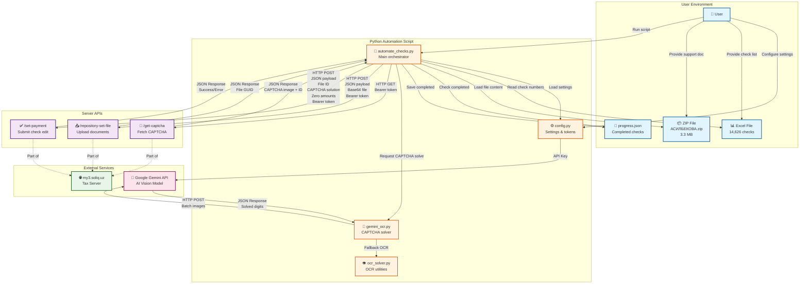

# Check Automation System - Architecture Map

## System Architecture Diagram



## Data Flow Summary

### 1️⃣ **Initialization Phase**
```
User → Config → Script
User → Excel → Script  
User → ZIP → Script
```

### 2️⃣ **Per Check Processing (×14,626)**
```
Script → Server: GET /get-captcha
       ← CAPTCHA image + ID

Script → Gemini API: POST (CAPTCHA image)
       ← Solved digits (6 digits)

Script → Server: POST /repository-set-file (ZIP file)
       ← File GUID

Script → Server: POST /set-payment (All data)
       ← Success/Error response

Script → progress.json: Save completed check
```

### 3️⃣ **Retry Logic**
```
CAPTCHA Error → Retry with new CAPTCHA (max 2 attempts)
Other Error → Skip (will retry on next run)
Duplicate (9099) → Mark as success
```

## Key Components

| Component | Purpose | Size/Count |
|-----------|---------|------------|
| `automate_checks.py` | Main automation logic | ~1,000 lines |
| `config.py` | Settings, tokens, URLs | Configuration |
| `gemini_ocr.py` | AI-powered CAPTCHA solving | Gemini Flash 2.0 |
| Excel file | Check numbers source | 14,626 rows |
| ZIP file | Support document | 3.3 MB |
| `progress.json` | Completed checks tracker | 275 checks |

## API Endpoints

| Endpoint | Method | Purpose | Authentication |
|----------|--------|---------|----------------|
| `/home/get-captcha` | GET | Fetch CAPTCHA | Bearer token |
| `/file/repository-set-file` | POST | Upload document | Bearer token |
| `/check-edit/set-payment` | POST | Submit check edit | Bearer token |

## Success Metrics
- **Processed**: 275 checks
- **Success Rate**: 77.5%
- **CAPTCHA Failures**: 22.5%
- **Duplicates**: 1 check (0.4%)
- **Processing Speed**: 0.31-0.41 checks/sec
